# Backlog2SpecAgent

A CLI tool that turns an Azure DevOps work item into a structured, ready-to-use spec — in seconds.

Given a work item ID (PBI, tus, bug, feature, epic), it fetches the ticket from ADO, enriches it with AI (filling context, edge cases, ambiguities), optionally retrieves relevant source files from your indexed codebase for grounding, then generates a structured spec tailored to your project's stack and conventions.

---

## Commands

```bash
# Generate a spec for a single work item (PBI, TUS, BUG)
backlog-2-spec-agent spec 12345

# Generate a spec for a single work item and save to markdown file
backlog-2-spec-agent spec 12345 --output ./spec/feature-12345.md

#  Generate a spec for a single work item in JSON format (pipe-friendly)
backlog-2-spec-agent spec 12345 --raw

# Export all children of a Feature or Epic
backlog-2-spec-agent spec 12345 --feature
backlog-2-spec-agent spec 12345 --epic
```

`--feature` and `--epic` generate a spec per child work item and write them to `spec/<id>-<slug>/`, with a `_summary.md` index. They are mutually exclusive.

---

## Spec output format

```
── Goal ─────────────────────────────────────────
Add rate limiting to the login endpoint so accounts lock after 5 failed attempts.
The lockout state is persisted per user and resets on successful login.

── Behaviour ────────────────────────────────────
  • Increment a failed attempt counter on each wrong password
  • Lock the account after 5 consecutive failures
  • Return 423 with a lockout message when the account is locked
  • Reset the counter on successful login
  • Normalize email to lowercase before lookup

── Edge Cases ───────────────────────────────────
  ⚠ Mixed-case email must match existing accounts
  ⚠ Concurrent login attempts must not bypass the counter

── Out of Scope ─────────────────────────────────
SSO, session timeout, password reset

── Files to Change ──────────────────────────────
  • src/Services/AuthService.cs: add EnforceLockout() and ResetAttempts()
  • src/Repositories/UserRepository.cs: add UpdateFailedAttempts()
  • src/Controllers/LoginController.cs: return 423 on locked account
```

---
## Architecture Overview



---

## Azure environment setup

The ARM template in `infra/azuredeploy.json` provisions everything you need:
- Azure AI Services account with a GPT-4o deployment
- Azure AI Foundry hub and project
- Azure AI Search service (for RAG)

### 1. Deploy with Azure CLI

```bash
az group create --name b2s-rg --location eastus

az deployment group create \
  --resource-group b2s-rg \
  --template-file infra/azuredeploy.json \
  --parameters prefix=b2s location=eastus

# Read the outputs — you will need these values when setting secrets
az deployment group show \
  --resource-group b2s-rg \
  --name azuredeploy \
  --query properties.outputs
```

### 2. Deploy with PowerShell

```powershell
New-AzResourceGroup -Name b2s-rg -Location eastus

New-AzResourceGroupDeployment `
  -ResourceGroupName b2s-rg `
  -TemplateFile infra/azuredeploy.json `
  -prefix b2s `
  -location eastus

(Get-AzResourceGroupDeployment -ResourceGroupName b2s-rg -Name azuredeploy).Outputs
```

### 3. Deploy from the Azure Portal

Go to **portal.azure.com → Deploy a custom template → Build your own template in the editor**, paste `infra/azuredeploy.json`, fill in `prefix` and `location`, then deploy.

> **GPT-4o regions:** `eastus`, `eastus2`, `swedencentral`, `australiaeast`, `westus`, `westus3`. Use the same region for all resources.

> **Search SKU:** `free` works for small repos (≤ 50 MB, 1 per subscription). Use `basic` for a real codebase.

### Create the Azure OpenAI Assistant

1. Go to [oai.azure.com](https://oai.azure.com) → **Assistants → Create**.
2. Name it (e.g. `backlog2spec-agent`) and note the **Assistant ID** — you will need it as `AzureAI:AssistantId`.
3. Select the `gpt-4o` deployment.
4. Paste this system prompt:

```
You are a senior software engineer generating production-ready structured specs
from Azure DevOps work items.

You receive a JSON object with:
  workItem:      the ADO ticket data (id, title, description, acceptanceCriteria)
  projectConfig: stack information
  repoContext:   relevant source file snippets

Output ONLY a valid JSON object (no markdown, no prose) matching this schema:
{
  "goal": "string",
  "behaviour": ["string"],
  "edgeCases": ["string"],
  "outOfScope": ["string"],
  "filesToChange": [{ "file": "string", "change": "string" }]
}

Rules:
- Follow Clean Architecture principles
- Reference real file paths from repoContext when available
- Be complete: cover all edge cases implied by the ticket
```

5. Save. No tool definitions are needed in the portal.

### Index your codebase for RAG (run once, repeat after major changes)

```powershell
.\scripts\index-repo.ps1 `
    -SearchUrl  "https://<your-search>.search.windows.net" `
    -SearchKey  "<admin-key>" `
    -RepoPath   "C:\path\to\your-project"
```

Add the Azure AI Search secrets:

```bash
dotnet user-secrets set "AzureSearch:Endpoint"   "https://<name>.search.windows.net"
dotnet user-secrets set "AzureSearch:ApiKey"      "your-search-admin-key"
dotnet user-secrets set "AzureSearch:IndexName"   "codebase-chunks"
```

The script scans `.cs` and `.md` files, splits them into 300–500 line chunks, and upserts them to the index. It is safe to re-run.

### Create an Azure DevOps PAT

Each developer needs their own Personal Access Token.

1. Go to `https://dev.azure.com/{your-org}/_usersSettings/tokens` → **New Token**.
2. Set **Work Items: Read** (add **Code: Read** if you want source-file context from your ADO repo).
3. Copy the token — you will not see it again.

---

## CLI installation

```bash
git clone https://github.com/giuliabertea/Backlog2SpecAgent
cd Backlog2SpecAgent

dotnet pack src/Backlog2SpecAgent.Cli -o ./nupkg
dotnet tool install --global --add-source ./nupkg Backlog2SpecAgent.Cli
```

Verify:

```bash
backlog-2-spec-agent --version
```

> Use `--local` instead of `--global` if you prefer a per-project install. Run `dotnet new tool-manifest` in your project directory first.

### Set secrets

Run from inside the `Backlog2SpecAgent/src/Backlog2SpecAgent.Cli` directory. These are per-machine and never stored in files.

```bash
dotnet user-secrets set "AzureAI:Endpoint"       "https://<name>.openai.azure.com"
dotnet user-secrets set "AzureAI:ApiKey"          "your-api-key"
dotnet user-secrets set "AzureAI:DeploymentName"  "gpt-4o"
dotnet user-secrets set "AzureAI:AssistantId"     "asst_..."

dotnet user-secrets set "Ado:Pat"                 "your-ado-pat"
```

Agent mode adds these secrets (`AzureAI:UseAgent = true`):

```bash
dotnet user-secrets set "AzureAI:UseAgent"        "true"
dotnet user-secrets set "AzureAI:ProjectEndpoint" "https://<resource>.openai.azure.com/openai"
dotnet user-secrets set "AzureAI:ToolsApiKey"     "your-tools-api-key"
dotnet user-secrets set "AzureSearch:Endpoint"    "https://<name>.search.windows.net"
dotnet user-secrets set "AzureSearch:ApiKey"      "your-search-admin-key"
dotnet user-secrets set "AzureSearch:IndexName"   "codebase-chunks"
```

> `toolsApi.baseUrl` is read from `backlog-2-spec.json`, not from secrets — set it in the config file.

> If you used the ARM template, copy `aiServicesEndpoint`, `aiServicesKey`, and `gptDeploymentName` directly from the deployment outputs.

### Add the project config file (optional but recommended)

Place `backlog-2-spec.json` in the root of **your project** (not the Backlog2SpecAgent repo). The tool searches upward from the current directory to find it. Without it, the tool falls back to built-in defaults.

```json
{
  "project": {
    "name": "MyService",
    "language": "C#",
    "framework": ".NET 8",
    "testFramework": "xUnit",
    "architecture": "Clean Architecture",
    "description": "Optional short description of the project"
  },
  "conventions": {
    "naming": "PascalCase classes, camelCase fields",
    "folderStructure": "Feature-based",
    "specStyle": "Gherkin",
    "diPattern": "Constructor injection",
    "errorHandling": "Result<T> pattern, no exceptions for business logic",
    "testing": "AAA pattern, no mocks on domain, integration tests for infrastructure"
  },
  "toolsApi": {
    "baseUrl": "https://your-tools-api.azurewebsites.net"
  },
  "ado": {
    "organization": "https://dev.azure.com/your-org",
    "project": "YourProject",
    "repoName": "YourRepo",
    "branch": "main"
  },
  "devRulesFiles": [
    "dev-rules.md"
  ]
}
```

`ado.organization` and `ado.project` are required when the file is present. `repoName` and `branch` enable source-file context fetching from your ADO repo. `devRulesFiles` lists one or more markdown files whose content is concatenated and injected into every prompt (see [Project rules files](#project-rules-file)). `toolsApi.baseUrl` is required when running in agent mode (`AzureAI:UseAgent = true`).

Commit this file — it contains no secrets.

---

## Running the tool

### Smoke test

```bash
cd path/to/your-project
backlog-2-spec-agent spec 1 --mock
```

If it prints a spec, the tool is installed correctly.

### Live run

```bash
cd path/to/your-project
backlog-2-spec-agent spec 12345
```
### Update the tool

```bash
cd path/to/Backlog2SpecAgent
git pull
dotnet pack src/Backlog2SpecAgent.Cli -o ./nupkg
dotnet tool update --global --add-source ./nupkg Backlog2SpecAgent.Cli
```

---

## Other useful details

### Using specs with AI coding assistants

Save a spec with `--output`, attach it in Copilot Chat or Cursor, and use:

```
Implement the spec in the attached file.
Follow the "Files to Change" section exactly — only touch the listed files.
Do not implement anything listed under "Out of Scope".
```

For a full feature export (`--feature` or `--epic`):

```
Implement the following feature step by step.

The feature spec is in `spec/<folder>/00-feature.md`.
Each PBI spec is a numbered file in the same folder.

Rules:
1. Read the feature spec first to understand the overall goal and scope.
2. Implement each PBI in file order (01, 02, …), one at a time.
3. For each PBI, follow the "Files to Change" section exactly.
4. Respect "Out of Scope" — do not implement anything listed there.
5. After each PBI, summarise what you changed before moving to the next.
6. Do not refactor code outside of what the spec asks for.

Start with the feature spec, confirm your understanding, then begin PBI 01.
```

### Project rules file

`devRulesFiles` lists one or more markdown files that get injected verbatim into every prompt (concatenated with a blank line between files). Use them for constraints that are too nuanced for the structured config fields.

```markdown
# dev-rules.md

- Never put business logic in controllers.
- All service methods return Result<T>. Never throw exceptions from the service layer.
- Do not use AutoMapper. All mapping is done in dedicated mapper classes.
- The domain layer must not reference any infrastructure or application layer types.
- Repository interfaces live in the domain layer; implementations in the infrastructure layer.
- Commands and queries follow MediatR: VerbNounCommand / VerbNounCommandHandler.
```

Reference it in `backlog-2-spec.json` with `"devRulesFiles": ["dev-rules.md"]` and commit both files. To use multiple rules files, add more entries to the list — their contents are concatenated in order.

---

### Troubleshooting

| Error | Cause | Fix |
|---|---|---|
| `Missing required field: ado.organization` | Config file incomplete | Add the missing field |
| `Configuration error: devRulesFiles entry not found` | Path does not exist | Check each path in `devRulesFiles` is relative to `backlog-2-spec.json` |
| `Authentication error: Failed to connect to Azure DevOps` | Invalid PAT or org URL | Re-set `Ado:Pat` and verify `ado.organization` |
| `Authentication error: PAT expired or wrong scope` | PAT expired | Generate a new PAT with Work Items: Read |
| `AI response error: LLM returned invalid JSON` | Model returned malformed JSON | Check deployment name and quota; try again |
| `Unexpected error: AzureAI:Endpoint secret is missing` | User secrets not set | Run the secrets setup commands in the installation guide |
| `Unexpected error: AzureAI:AssistantId secret is missing` | Assistant ID not set | Copy the ID from Azure OpenAI Studio and set the secret |
| `toolsApi.baseUrl is missing in backlog-2-spec.json` | Agent mode but no URL set | Add `toolsApi.baseUrl` to `backlog-2-spec.json` |
| `No manifest file found` | Missing `.config/dotnet-tools.json` | Run `dotnet new tool-manifest` in your project root |
| `POST /threads → 401` | Wrong API key | Verify `AzureAI:ApiKey` matches the key under your Azure OpenAI resource |
| `POST /threads → 404` | Wrong endpoint format | Ensure `AzureAI:Endpoint` points to your Azure OpenAI resource URL |
| `Run <id> ended with status 'failed'` | Assistant run failed | Check the assistant config in Azure OpenAI Studio; verify deployment name is `gpt-4o` |
| `Azure AI Search → 401` | Wrong search API key | Use the **admin key** from Azure AI Search → Settings → Keys |
| `Azure AI Search → 404` | Wrong index name or URL | Check `AzureSearch:IndexName` matches the index created by `index-repo.ps1` |
| `index-repo.ps1` fails with 401 | Wrong search key | Use the admin key from Azure AI Search → Settings → Keys |
| `GPT-4o deployment fails with ModelNotFound` | Wrong region | Redeploy to `eastus`, `swedencentral`, or `australiaeast` |
